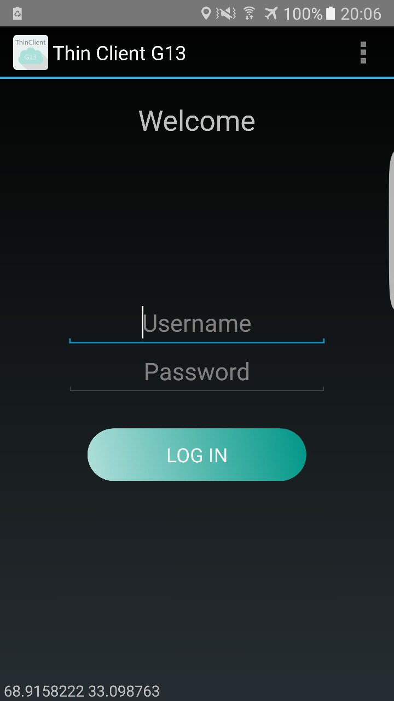

# ThinClient
<<<<<<< HEAD
# MobileOffload
=======

### This application was implemented to realize a thin-client computing service specifically targeted to mobile devices. 
Such a service realizes the following functions:
* allows the user to select a specific application from a list of supported ones;
* prioritizes a specific application according to the current location of the mobile device;
* executes the chosen application by starting a suitable virtual machine;
* connects to such a virtual machine through a remote desktop protocol;
* shows the content of the remote virtual machine and allows the user to interact with the
application;
* upon termination of the session, suspends or shuts down the virtual machine.

MultiVNC application is embedded.

<<<<<<< HEAD

>>>>>>> 538facdaef7e9069d884f7b79b341228368f4a11
# Elastomeric
=======

>>>>>>> 5774cad33da13141560cc7d482ce5709cfaf0c0c
# Shopping-List
